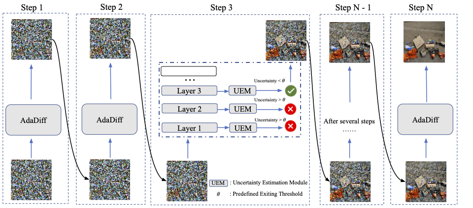

## AdaDiff<br> <sub><small>Official PyTorch implementation of [AdaDiff: Accelerating Diffusion Models through Step-Wise Adaptive Computation](https://arxiv.org/abs/2309.17074) (ECCV 2024)</small></sub>




Diffusion models achieve great success in generating diverse and high-fidelity images, yet their widespread application, especially in real-time scenarios, is hampered by their inherently slow generation speed. The slow generation stems from the necessity of multi-step network inference. While some certain predictions benefit from the full computation of the model in each sampling iteration, not every iteration requires the same amount of computation, potentially leading to inefficient computation. Unlike typical adaptive computation challenges that deal with single-step generation problems, diffusion processes with a multi-step generation need to dynamically adjust their computational resource allocation based on the ongoing assessment of each step's importance to the final image output, presenting a unique set of challenges. In this work, we propose AdaDiff, an adaptive framework that dynamically allocates computation resources in each sampling step to improve the generation efficiency of diffusion models. To assess the effects of changes in computational effort on image quality, we present a timestep-aware uncertainty estimation module (UEM). Integrated at each intermediate layer, the UEM evaluates the predictive uncertainty. This uncertainty measurement serves as an indicator for determining whether to terminate the inference process. Additionally, we introduce an uncertainty-aware layer-wise loss aimed at bridging the performance gap between full models and their adaptive counterparts.

--------------------


This codebase implements the AdaDiff which aims to accelerate the inference of diffusion generation via early exiting. By introducing a simple but effective Uncertainty Estimation Module(UEM) and Uncertainty-Aware Layer-wise Loss, AdaDiff skip backbone layers adaptively through different sampling steps, achieving more than 40% speedup with minimal performance drop on CIFAR-10, CelebA, COCO and ImageNet. In this repo, we provide the training and evalutation scripts to reproduce our results. Also, we provide our pretrained weights for evaluation.

Since AdaDiff introduce negligible new parameters to U-ViT archiecture, our method requires similar memory-budget as U-ViT.


## Dependency

```sh
pip install torch torchvision --extra-index-url https://download.pytorch.org/whl/cu116  # install torch-1.13.1
pip install accelerate==0.12.0 absl-py ml_collections einops wandb ftfy==6.1.1 transformers==4.23.1

# xformers is optional, but it would greatly speed up the attention computation.
pip install -U xformers
pip install -U --pre triton
```

* This repo is based on [`timm==0.3.2`](https://github.com/rwightman/pytorch-image-models), for which a [fix](https://github.com/rwightman/pytorch-image-models/issues/420#issuecomment-776459842) is needed to work with PyTorch 1.8.1+. (Perhaps other versions also work, but I haven't tested it.)
* We highly suggest install [xformers](https://github.com/facebookresearch/xformers), which would greatly speed up the attention computation for *both training and inference*.


If you want to reproduce our results by finetuning, you need to firstly download the pretrained weight from following links:

## Pretrained Models for AdaDiff Finetuning(from U-ViT Repo)


|                                                         Model                                                          |  FID  | training iterations | batch size |
|:----------------------------------------------------------------------------------------------------------------------:|:-----:|:-------------------:|:----------:|
|      [CIFAR10 (U-ViT-S/2)](https://drive.google.com/file/d/1yoYyuzR_hQYWU0mkTj659tMTnoCWCMv-/view?usp=share_link)      | 3.11  |        500K         |    128     |
|   [CelebA 64x64 (U-ViT-S/4)](https://drive.google.com/file/d/13YpbRtlqF1HDBNLNRlKxLTbKbKeLE06C/view?usp=share_link)    | 2.87  |        500K         |    128     |
| [ImageNet 256x256 (U-ViT-L/2)](https://drive.google.com/file/d/1w7T1hiwKODgkYyMH9Nc9JNUThbxFZgs3/view?usp=share_link)  | 3.40  |        300K         |    1024    |
|      [MS-COCO (U-ViT-S/2)](https://drive.google.com/file/d/15JsZWRz2byYNU6K093et5e5Xqd4uwA8S/view?usp=share_link)      | 5.95  |         1M          |    256     |

## Models after AdaDiff Finetuning
All of the models to reproduce the results in the paper can be found in [Link](https://mbzuaiac-my.sharepoint.com/:f:/g/personal/shengkun_tang_mbzuai_ac_ae/Evc3r6RLBhNDp5ee7MGCj5cB5ecfyMxATP1KIaiAceRcaw?e=EmDIB6)

## Preparation Before Training and Evaluation

#### Autoencoder
Download `stable-diffusion` directory from this [link](https://drive.google.com/drive/folders/1yo-XhqbPue3rp5P57j6QbA5QZx6KybvP?usp=sharing) (which contains image autoencoders converted from [Stable Diffusion](https://github.com/CompVis/stable-diffusion)). 
Put the downloaded directory as `assets/stable-diffusion` in this codebase.
The autoencoders are used in latent diffusion models.

#### Data
* ImageNet 256x256 and ImageNet 512x512: Extract ImageNet features according to `scripts/extract_imagenet_feature.py`.
* MS-COCO: Download COCO 2014 [training](http://images.cocodataset.org/zips/train2014.zip), [validation](http://images.cocodataset.org/zips/val2014.zip) data and [annotations](http://images.cocodataset.org/annotations/annotations_trainval2014.zip). Then extract their features according to `scripts/extract_mscoco_feature.py` `scripts/extract_test_prompt_feature.py` `scripts/extract_empty_feature.py`.

#### Reference statistics for FID
Download `fid_stats` directory from this [link](https://drive.google.com/drive/folders/1yo-XhqbPue3rp5P57j6QbA5QZx6KybvP?usp=sharing) (which contains reference statistics for FID).
Put the downloaded directory as `assets/fid_stats` in this codebase.
In addition to evaluation, these reference statistics are used to monitor FID during the training process.

## Training


We use the [huggingface accelerate](https://github.com/huggingface/accelerate) library to help train with distributed data parallel and mixed precision. The following is the training command:
```sh
# the training setting
num_processes=4  # the number of gpus you have, e.g., 2
train_script=train.py  # the train script, one of <train.py|train_ldm.py|train_ldm_discrete.py|train_t2i_discrete.py>
                       # train.py: training on pixel space
                       # train_ldm.py: training on latent space with continuous timesteps
                       # train_ldm_discrete.py: training on latent space with discrete timesteps
                       # train_t2i_discrete.py: text-to-image training on latent space
config=configs/cifar10_uvit_small.py  # the training configuration
                                      # you can change other hyperparameters by modifying the configuration file
pretrained_weight=/home/dongk/dkgroup/tsk/projects/U-ViT/ckpt/cifar10_uvit_small.pth # Please adjust this path to your weight path.
# launch training
accelerate launch --multi_gpu --num_processes $num_processes --mixed_precision fp16 
    $train_script --config=$config --is_train=True --pretrained_weight=${pretrained_weight}
```


We provide all commands to reproduce AdaDiff training in the paper:
```sh
# CIFAR10 (U-ViT-S/2)
sh ./train_cifar.sh

# CelebA 64x64 (U-ViT-S/4)
sh ./train_celeba.sh


# ImageNet 256x256 (U-ViT-L/2)
sh ./train_imagenet.sh

# MS-COCO (U-ViT-S/2)
sh ./train_coco.sh
```


## Evaluation (Compute FID)

We use the [huggingface accelerate](https://github.com/huggingface/accelerate) library for efficient inference with mixed precision and multiple gpus. The following is the evaluation command:
```sh
# the evaluation setting
export num_processes=4 # the number of gpus you have, e.g., 2
export eval_script=eval.py  # the evaluation script, one of <eval.py|eval_ldm.py|eval_ldm_discrete.py|eval_t2i_discrete.py>
                     # eval.py: for models trained with train.py (i.e., pixel space models)
                     # eval_ldm.py: for models trained with train_ldm.py (i.e., latent space models with continuous timesteps)
                     # eval_ldm_discrete.py: for models trained with train_ldm_discrete.py (i.e., latent space models with discrete timesteps)
                     # eval_t2i_discrete.py: for models trained with train_t2i_discrete.py (i.e., text-to-image models on latent space)
export config=configs/cifar10_uvit_small.py # the training configuration

threshold=0.92 #Please adjust this for trade-off
# launch evaluation
accelerate launch   --num_processes $num_processes --mixed_precision fp16 $eval_script
         --config=$config
         --exit_threshold=${threshold}
          --nnet_path=/home/dongk/dkgroup/tsk/projects/U-ViT/workdir/cifar10_uvit_small/AdaDiff/75000.ckpt/nnet_ema.pth # Please adjust to your path
```
The generated images are stored in a temperary directory, and will be deleted after evaluation. If you want to keep these images, set `--config.sample.path=/save/dir`.


We provide all commands to reproduce FID results in the paper:
```sh
# CIFAR10 (U-ViT-S/2)
sh ./eval_cifar.sh

# CelebA 64x64 (U-ViT-S/4)
sh ./eval_celeba.sh

# ImageNet 256x256 (U-ViT-L/2)
sh ./eval_imagenet.sh

# MS-COCO (U-ViT-S/2)
sh ./eval_coco.sh

```


## References
If you find the code useful for your research, please consider citing
```bib
@article{tang2023deediff,
  title={Deediff: Dynamic uncertainty-aware early exiting for accelerating diffusion model generation},
  author={Tang, Shengkun and Wang, Yaqing and Ding, Caiwen and Liang, Yi and Li, Yao and Xu, Dongkuan},
  journal={arXiv preprint arXiv:2309.17074},
  year={2023}
}
```

This implementation is based on
* [U-ViT](https://github.com/baofff/U-ViT) (Main Architecture)
